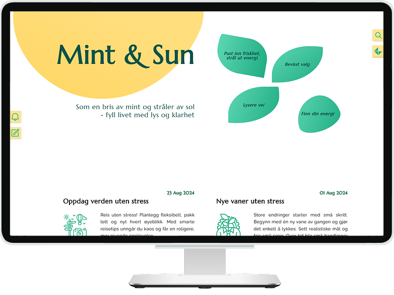
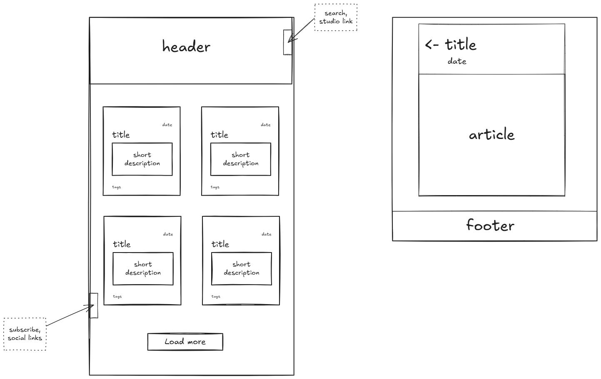

# Project name: Mint & Sun

### Project Goal:

A small project for exploring Sanity CMS as a modern headless content platform and understand how it integrates into a Next.js application. This includes learning how to structure and model content, set up a custom Studio environment, and establish efficient data fetching workflows.

## 💎 Features

[](preview.png)

Blog on **Next.js** + **Sanity**. Simple design with minimal SEO optimization, deployed on **Vercel** with configured **Sanity Webhook** that automatically notify Vercel to rebuild the site after updating data in Sanity.

### 🖥️ Frontend (Next.js 15)

- Load all posts with pagination (Load More button)
- Render a single post via GROQ query using slug
- Free-text search
- Filter posts by category
- Integrated Sanity Studio

### ⚙️ Backend (Sanity Studio)

**Posts**

- View: all / published / drafts
- Create and edit posts
- When selecting a category, the icon and its alt (tags) are set automatically

**Categories**

- Create and edit categories
- View all posts within a category
- Alt text of the icon is used as keyword tags
- Supports inline images (position options: left / right)

## 🧩 Tech Stack


<!-- end:tech-stack -->

<details style="border:1px solid #d4d4d4; border-radius:2px; padding:1rem;">
<summary><h4 style="display:inline; padding-left:6px;">🗃 Dependencies</h4></summary>

```bash
clsx
date-fns
framer-motion
sanity-plugin-documents-pane
sass
```

</details>

### [Design sketch](https://excalidraw.com/#json=RSmZXVfYtyhUMBPwriHsZ,AFBSdJr8jcngmlqm3sOzSg)

[](mint-and-sun-sketch.png)

---

### 📋 TODO:

- [ ] more style options for Rich text (body block)
- [ ] preview thumbnails/images
- [ ] responsive design (design is optimized for large screens, 1024px and above)
- [ ] full-featured search using Algolia or Typesense
- [ ] studio preview
- [ ] studio auth (middleware?)
